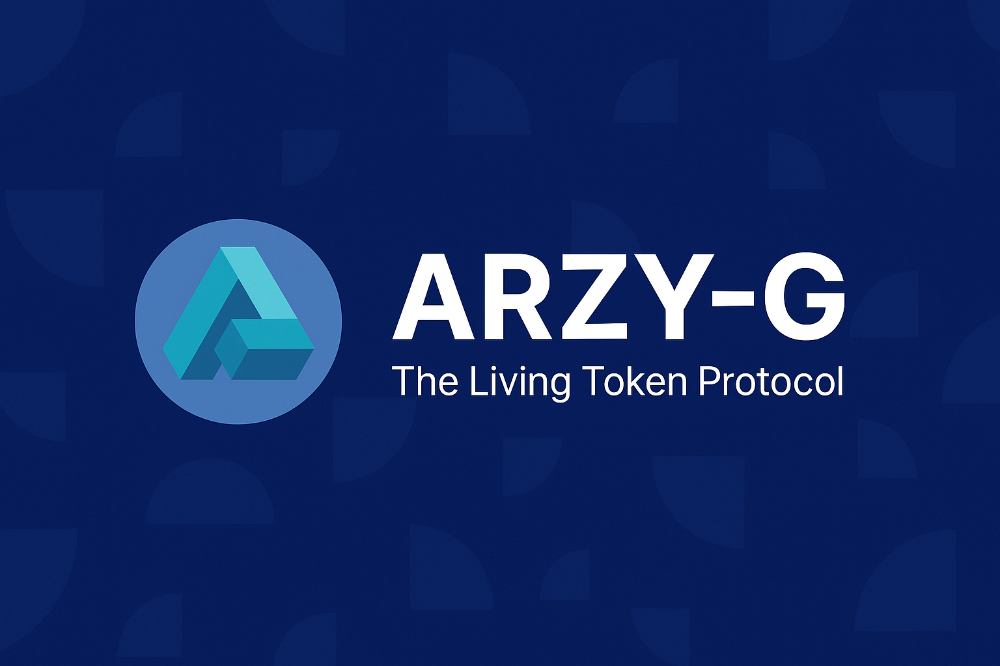

 ARZY-G: The First Web4 Token Standard

  

> "Value must be born from usefulness, not mining."

ARZY-G is the first Web4 token standard that introduces a new paradigm: tokens are not mined or farmed — they are born from verified usefulness.

This project marks the genesis of Web4 and is officially registered by Genesis NFT #001 on-chain. It is a protocol, a philosophy, and a movement.

---

🔗 Links

🌐 Website: https://arzy-g.com

💎 Genesis NFT #001: OpenSea

🧠 Twitter: @ArzykulM

📜 Whitepaper: ARZY-G_Whitepaper_v1.0.pdf

💻 Smart Contract: contracts/ARZYG.sol

---

📘 Contents

Overview

Philosophy

Smart Contract Logic

How to Build on ARZY-G

License

Credits

---

🧭 Overview

ARZY-G is not a token, it's a standard. It introduces:

A token born from usefulness, not minting or mining

A built-in record of positive action (workHistory[])

A protocol that rewards contribution over speculation

---

💡 Philosophy

> ARZY-G redefines how we value digital actions.

In Web4, the measure of a person is not how much energy they spend, but how much value they create.

This approach flips the economic model of Web3 on its head. Instead of rewarding computing power, it rewards verified usefulness: social, economic, creative, or technical.

---

🔐 Smart Contract Logic

The core contract (ARZYG.sol) introduces:

birthToken() — token is born from approved usefulness

reserve — the system or AI that controls issuance

workHistory[] — transparent history of value created

You can review the full code here: contracts/ARZYG.sol

---

🚀 How to Build on ARZY-G

ARZY-G is open-source under MIT license. Developers can:

1. Fork this repository

2. Import ARZYG.sol into their dApps or DAOs

3. Customize the birthToken() trigger based on their logic (AI, DAO, Proof-of-Action, etc.)

If you build something — let the world know: #BuildOnARZYG

---

📜 License

This project is licensed under the MIT License. See LICENSE for details.

> Note: Attribution to the original creator is required in public implementations.

---

✍️ Credits

Creator: Arzykul Muratov (Kyrgyzstan, 2025)
AI Assistant: GPT-4o (OpenAI)
Genesis Token: NFT #001

Web4 has already begun. This is your invitation to build it together.

